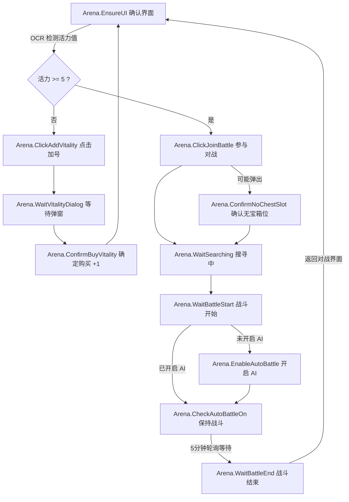

# 玩家对战（竞技场）全自动管线设计规格

## 1. 目标与业务背景

在《飘流幻境新世界》中，“玩家对战”是玩家日常参与 PVP 竞技、获取积分与胜利宝箱的核心玩法。
本管线旨在提供一套**零人工干预、高鲁棒性、跨模拟器兼容、支持参数自定义与数据统计**的全自动闭环系统：

1. **活力值自动检测与补充**：进入界面自动识别当前活力值，当活力值不足 5 点时，自动点击加号并在弹窗中确认消耗绿钻/绑钻补充，循环补齐至 5 点后启动对战。
2. **无宝箱栏位弹窗自愈**：参与对战时若宝箱栏已满，自动识别并点击“确定”继续对战。
3. **搜寻对手与场景过渡**：匹配期间持续守护，识别进入战斗场景。
4. **AI 自动战斗托管**：进入战斗后若未开启 AI 托管，自动点击开启。
5. **长效战斗守护与超时保护**：单场战斗支持 3 ~ 10 分钟平滑守护（默认 5 分钟超时保护），彻底解决战斗进行中被框架默认 10 秒超时误判打断的问题。
6. **结算与下一轮循环**：战斗胜利或结束后自动识别返回主界面，闭环流转开启下一场。
7. **数据统计与战报系统**：实时记录单场耗时、平均耗时、累计场次与绿钻消耗，停止时生成战报。

---

## 2. 状态机与 Pipeline 结构

管线主文件位于 [`assets/resource/pipeline/arena.json`](file:///d:/%E9%A3%98%E6%B5%81%E5%B9%BB%E5%A2%83%E6%96%B0%E4%B8%96%E7%95%8C/pln-auto/assets/resource/pipeline/arena.json)，任务入口为 `Arena.EnsureUI`：

---

## 3. 核心设计规范与技术要点

### 3.1 100% 纯 PNG 模板匹配（彻底杜绝写死屏幕绝对坐标）
- **痛点**：写死屏幕坐标（如 `target: [x, y]`）在模拟器存在微小 DPI 差异、窗口分辨率缩放或宽屏右下角 UI 自适应偏移时，极易点偏在按钮外围。
- **规范**：
  - 所有可交互元素（`join_battle.png`、`plus_btn.png`、`confirm_btn.png`、`auto_battle_off.png`）均从 720p 原生画面精确裁剪。
  - 使用 `recognition: "TemplateMatch"` + `action: "Click"` 时，不设置硬编码 `target`，框架会自动根据识别到的目标矩形框计算真实中心（Bounding Box Center）并自适应点击。

### 3.2 战斗长效轮询机制（突破框架 10 秒默认超时限制）
- **机制**：MaaFramework 节点等待默认超时为 10,000ms（10 秒）。
- **解法**：在 `Arena.CheckAutoBattleOn` 与 `Arena.WaitBattleEnd` 显式配置 `timeout: 300000`（5 分钟）与 `rate_limit: 1500`，并通过自引用 `next` 形成低开销平滑轮询。

### 3.3 多模拟器（雷电 9 / 雷电 14）双版本兼容
- 在 `assets/interface.json` 中提供通用 `雷电模拟器（ADB）`、`雷电模拟器 14（ADB）` 与 `雷电模拟器 9（ADB）`。
- 默认采用 `AdbControlScreenCapType: "Encode"` 模式，彻底避开雷电 9 缺少 `ldopengl64.dll` 的报错。

---

## 4. 参数自定义与统计系统设计

### 4.1 Task Options 可视化配置
在 [`assets/interface.json`](file:///d:/%E9%A3%98%E6%B5%81%E5%B9%BB%E5%A2%83%E6%96%B0%E4%B8%96%E7%95%8C/pln-auto/assets/interface.json) 中挂载：
1. **`ArenaBattleTimeout`**：单场战斗最高超时限制（下拉可选 3min / 5min / 10min，通过 `pipeline_override` 动态覆盖）；
2. **`ArenaMaxRounds`**：最大对战轮数限制（输入框，填 0 为无限循环）。

### 4.2 数据统计与战报输出（`agent/arena_stats.py`）
- 自动追踪单场开始与结束时间，实时计算单场耗时、平均耗时；
- 累计总场次、完成场次、超时场次及购买活力消耗的绿钻数；
- 停止时自动生成 `logs/arena_battle_report.txt` 战报与 `logs/arena_stats.json` 数据文件。
